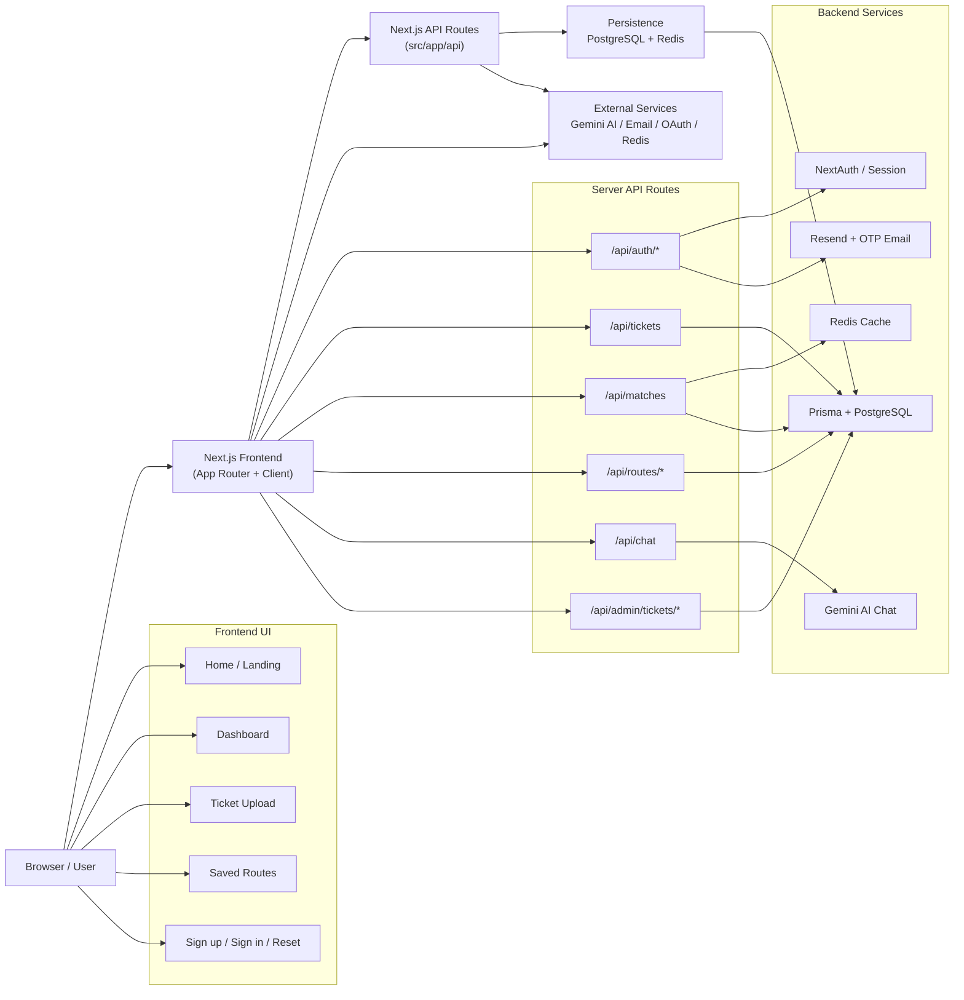

# Travellers Architecture

This document describes the architecture of the `travellers` repository and shows how the application is organized across frontend, backend, data, and external services.

## 1. High-Level Architecture

```mermaid
flowchart TD
  user["Browser / User"] --> frontend["Next.js Frontend\n(App Router)"]
  frontend --> pages["Pages & Components"]
  frontend --> shell["App Shell & Providers"]
  frontend --> api["API Routes / Server Handlers"]
  api --> services["Server-side Services"]
  services --> db["Persistence Layer"]

  subgraph PAGES[Frontend Pages & UI]
    pages1["/app/page.tsx"]
    pages2["/app/dashboard/"]
    pages3["/app/upload/"]
    pages4["/app/routes/"]
    pages5["/app/(auth)/signin, signup, reset"]
    pages6["src/components/*"]
  end

  subgraph SHELL[App Shell]
    shell1["src/app/layout.tsx"]
    shell2["src/components/site-header.tsx"]
    shell3["src/components/site-footer.tsx"]
    shell4["src/components/session-provider.tsx"]
    shell5["src/state/theme.tsx"]
  end

  subgraph API[API Routes]
    api1["/app/api/auth/*"]
    api2["/app/api/tickets/route.ts"]
    api3["/app/api/matches/route.ts"]
    api4["/app/api/routes/*"]
    api5["/app/api/chat/route.ts"]
    api6["/app/api/admin/tickets/*"]
  end

  subgraph SERVICES[Server-side Services]
    svc1["NextAuth + Credentials + OAuth"]
    svc2["Prisma + PostgreSQL"]
    svc3["Redis cache"]
    svc4["Resend + OTP email"]
    svc5["Gemini AI chat"]
    svc6["Ticket file storage (placeholder)"]
  end

  subgraph PERSIST[Persistence]
    db1["PostgreSQL\nUser/Ticket/Route/Account/Session/VerificationToken"]
    db2["Redis\nmatch caching"]
  end

  pages --> pages1
  pages --> pages2
  pages --> pages3
  pages --> pages4
  pages --> pages5
  pages --> pages6
  shell --> shell1
  shell --> shell2
  shell --> shell3
  shell --> shell4
  shell --> shell5
  api --> api1
  api --> api2
  api --> api3
  api --> api4
  api --> api5
  api --> api6
  services --> svc1
  services --> svc2
  services --> svc3
  services --> svc4
  services --> svc5
  services --> svc6
  db --> db1
  db --> db2
```



## 2. Frontend Architecture

### App Router and Pages

The app is built with Next.js App Router in `src/app/`.

Key route groups:
- `src/app/page.tsx` - public homepage
- `src/app/about/page.tsx` - about page
- `src/app/contact/page.tsx` - contact page
- `src/app/privacy/page.tsx` - privacy page
- `src/app/terms/page.tsx` - terms and conditions
- `src/app/dashboard/` - authenticated dashboard experience
- `src/app/upload/page.tsx` - ticket upload flow
- `src/app/routes/` - saved routes and route visualization
- `src/app/(auth)/` - sign in / signup / reset password flows

### Shared UI and client support

Shared UI components live in `src/components/`:
- `site-header.tsx`, `site-footer.tsx`, `Sidebar.tsx`
- `ticket-upload-form.tsx`, `sign-in-form.tsx`, `sign-up-form.tsx`
- `route-viewer.tsx`, `offline-route-renderer.tsx`, `maplibre-route.tsx`
- `chatbot.tsx`, `FloatingActions.tsx`, `pwa-*` helpers

State and utilities:
- `src/state/theme.tsx` - theme provider
- `src/lib/auth.ts` - NextAuth auth helpers
- `src/lib/prisma.ts` - Prisma client singleton
- `src/lib/redis.ts` - Redis singleton
- `src/lib/withValidation.ts` - Zod route validation wrapper

## 3. Backend Architecture

### API route organization

The backend is implemented using Next.js route handlers in `src/app/api/`.

```
src/app/api/
  auth/             # signup, signin, OTP, password reset
  tickets/          # create and list user tickets
  matches/          # discover verified travelers
  routes/           # save/load/delete user routes
  chat/             # AI chat assistant using Gemini
  admin/tickets/    # admin ticket review and verification
```

### Authentication and session flow

- `src/lib/auth.ts` configures NextAuth with `PrismaAdapter`
- `Credentials` provider authorizes email/password logins
- `GoogleProvider` and `AppleProvider` are available for OAuth
- `auth()` is called in server route handlers to validate the current user
- Roles are preserved in JWT session payloads

### Core route handlers

- `POST /api/auth/signup` — register user, hash password, create OTP, send verification email
- `POST /api/auth/verify-otp` — verify email with OTP code
- `POST /api/auth/resend-otp` — resend one-time passcode
- `POST /api/auth/forgot-password` — send reset email
- `POST /api/auth/reset-password` — reset password with token
- `PUT /api/auth/change-password` — change password for authenticated users
- `GET /api/user/profile`, `PATCH /api/user/profile` — fetch and update user profile
- `POST /api/tickets`, `GET /api/tickets` — submit and list user tickets
- `GET /api/matches` — find verified travellers matching destination and date window
- `GET /api/routes`, `POST /api/routes`, `DELETE /api/routes` — manage user route records
- `POST /api/chat` — Gemini-powered TravelBox AI assistant
- `GET/PATCH /api/admin/tickets` and `/api/admin/tickets/[id]` — admin ticket review

### External/infrastructure services

- Redis caching for match queries:
  - `src/lib/redis.ts`
  - cached results reduce repeated match searches
- Email sending via `src/lib/email.ts`
- OTP generation via `src/lib/otp.ts`
- AI chat via Google Gemini API in `src/app/api/chat/route.ts`

## 4. Data Model

The Prisma schema defines the core storage types in `prisma/schema.prisma`.

### User
- `id`, `name`, `email`, `passwordHash`, `image`
- `bio`, `location`, `homeLocation`, `phone`
- `role` (`USER` or `ADMIN`)
- `emailVerified`, `otp`, `otpExpires`
- `resetToken`, `resetTokenExpires`
- relations: `tickets`, `accounts`, `sessions`, `routes`

### Ticket
- user-submitted travel proof record
- `destination`, `departureDate`, `ticketUrl`, `status`
- status lifecycle: `PENDING`, `VERIFIED`, `REJECTED`

### Route
- saved route geometry and metadata
- `originLat`, `originLng`, `destinationLat`, `destinationLng`
- `distance`, `duration`, `encodedPolyline`
- optional `waypoints`, `tripName`, `notes`

### NextAuth models
- `Account`, `Session`, `VerificationToken`
- standard schema for session storage and OAuth accounts

## 5. Architecture Diagram


## 6. Important behavior patterns

### Authentication
- All protected APIs call `auth()` from `src/lib/auth.ts`
- Session state is provided to pages via `AuthSessionProvider`
- User role is used for admin-only endpoints

### Match discovery
- `GET /api/matches` filters verified tickets by destination and ±3 day date window
- Query results are cached in Redis for 5 minutes

### Ticket verification workflow
- Users upload tickets via `POST /api/tickets`
- Admin users approve or reject through `admin/tickets` routes
- Verified tickets become eligible for matching

### Route saving / offline support
- Saved routes are persisted as `Route` records in PostgreSQL
- Routes include an encoded polyline and metadata
- Frontend route UI lives in `src/components/route-viewer.tsx` and offline route components

## 7. Repo organization summary

```
/                  # repository root
  package.json
  next.config.js
  prisma/           # schema and migrations
  public/           # static assets
  docs/             # documentation
  scripts/          # local development helpers
  src/
    app/            # Next.js App Router pages + API routes
    components/     # reusable React components
    lib/            # backend helpers and utilities
    state/          # theme and client state
    styles/         # global CSS
    types/          # type declarations
```

## 8. Notes

- The application uses a hybrid server/client model: most pages render server-side, client components handle forms and interactivity.
- `src/lib/prisma.ts` and `src/lib/redis.ts` use development-safe singletons to avoid duplicate connections during HMR.
- The AI chat route is optional and requires `GEMINI_API_KEY`.
- Ticket file storage is currently placeholder content and may need real object storage integration later.
